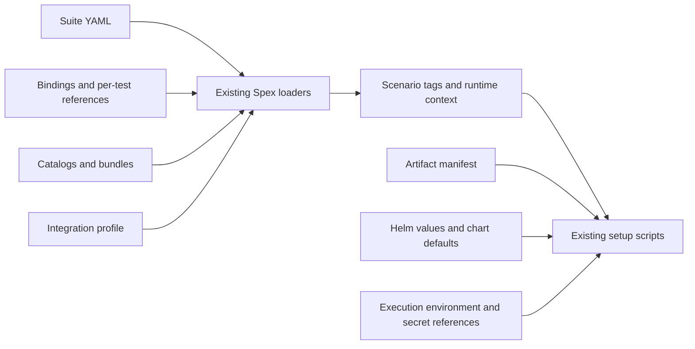
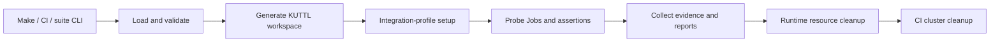

# Scenario runtime v1: architecture inventory

## Baseline

Spex starts at `c7a76476dd042a9212818aa098500ea655f6ee11` (rc.37).
Migration-testbench starts at `d28942f24ac9debab2cd1d766c143f4a337cfdfa`.
Both worktrees were clean before this campaign. The user reported all Gateway
Migration acceptance scenarios passing in CI. That report is the historical
acceptance baseline, not a new execution from this workspace.

Fresh qualification results and external blockers live in
`spex-scenario-runtime-v1/BASELINE.md` and `blockers.json`.

## Current Spex entrypoint

`cmd/spex/main.go` calls `internal/spex.Run`. Go 1.26.7 builds the CLI and probes.
`internal/workspace` loads suites, scenarios, bindings, catalogs and integration
bundles; it expands operations and generates KUTTL workspaces. `internal/probe`
executes protocol operations. `bundles/http/probe` is a separate Go module.
The existing test languages are YAML and Gherkin `.feature` files. The proposed
brace-language examples are illustrative; v1 must preserve the existing languages.

## Current migration-testbench entrypoint

`Makefile` validates suites and catalogs. `scripts/suite_selection.py` selects
groups and invokes `spex suite`. GitHub runs `scripts/kind_ci.sh prepare`, one
`run GROUP` per selected group, `summary`, and `cleanup`. AWS dev has its own
suite entrypoints. The repository has no Go configuration module or single
configuration resolver that can simply be moved into a runtime package.

## Current configuration resolution chain

Suite YAML selects binding, integration profile, catalogs, bundles and scenario
references. Spex loads these through `workspace.LoadScenarioSuite` and
`loadSuiteInputs`, retaining per-reference configuration and CLI overrides.
`scripts/gateway_scenario_requirements.py` resolves setup tags and explicit tag
overrides. `integration/gateway-artifacts.json` owns chart/image pins;
`scripts/gateway_artifacts.py` resolves them. Helm merges chart defaults, checked-in
values and script arguments. Environment references provide secrets at execution.

The new runtime must invoke this chain before applying typed scenario overrides.
It must not duplicate chart defaults, artifact pins or setup-tag rules in Spex.

## Current test discovery mechanism

Suites enumerate feature/YAML references. Catalog expansion creates runnable
scenarios. Tags implement selection; adjacent `.groups.json` files describe
declared groups. Explicit group selection forms a union without duplicate tests.
An absent group filter selects every scenario in the selected suite.

## Current environment setup mechanism

Kind CI creates one shared cluster and kubeconfig. Each generated KUTTL workspace
runs the existing integration-profile commands. Shared releases use checked
receipts; stateful scenario services get fresh databases and pod annotations.
KUTTL starts probe Jobs and checks their outcomes. Spex collects evidence before
removing runtime resources. The CI trap retains exit codes and collects failure
diagnostics; final cleanup deletes the Kind cluster. Per-scenario credential
hooks supply a private child environment without modifying the parent process.

## Current artifact mechanism

`.spex/generated` contains scenario context, rendered operations, KUTTL manifests,
operation evidence and scenario reports. Suite reports include JSON, YAML and
JUnit. `artifacts/kuttl/app-logs` contains group outcomes, full console logs and
service diagnostics. GitHub uploads both roots. Suite execution historically
returns 1 for failure; validation and runner errors have existing classifications
in `internal/spex/doctor_plan.go`. Shell group timeouts return 124.

## Existing release/distribution mechanism

SemVer release-candidate tags trigger `.github/workflows/release.yaml`. Security
and production-candidate gates precede binary archives, checksums, manifests,
provenance and the HTTP source bundle. The workflow creates a draft release.
Migration-testbench pins `SPEX_VERSION` and downloads Linux amd64 assets.
The action must use this distribution and allow a local executable override.

## Compatibility constraints

- Keep YAML/Gherkin parsing and legacy entrypoints working.
- Keep environment selection separate from group selection.
- Preserve fresh scenario state, current timing windows, real chart usage,
  diagnostic evidence and cleanup behavior.
- Wrap existing resolution and execution; avoid another copy of the Python
  configuration rules or Helm configuration.
- Treat arbitrary configuration and inline input as potentially secret-bearing.
  Canonicalization never expands references; runtime validation precedes persistence.
- Keep runtime registration in process. Invoking existing lifecycle commands is
  not a new subprocess runtime protocol.
- Keep company-specific topology and registry details in migration-testbench.
- Local live acceptance requires Docker, Kind and access to the private registry.
  Missing infrastructure blocks live qualification, not independent unit work.
